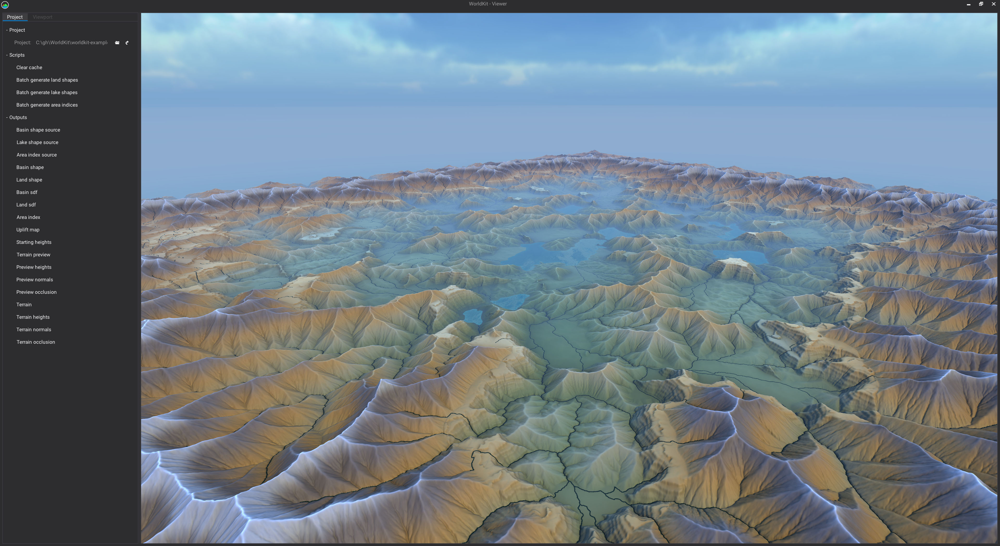
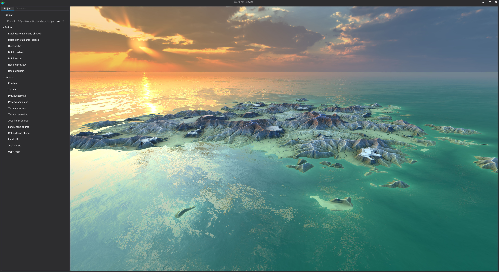
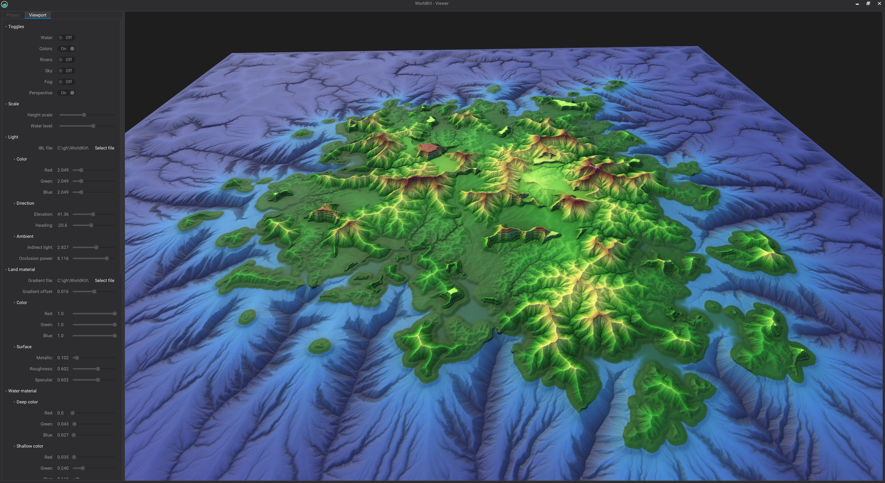

# WorldKit
A toolkit for generating virtual worlds.

## To run the WorldKit Viewer, follow these steps:
1. Clone the repository from github.
2. Download and install IntelliJ IDEA Community (https://www.jetbrains.com/idea/). This is optional.
3. Download and install GraalVM Community (https://www.graalvm.org/downloads/). It works with OpenJDK but runs more efficiently on GraalVM.
4. Open `build.gradle.kts` as a project in IntelliJ IDEA.
5. Create a new run configuration in IntelliJ.
    * For Main class, browse and select `Viewer`.
    * Under VM options use `-Xms1g -Xmx16g -Dwk.log.to.sys.out=true`.
    * Choose a Working directory. I use a directory called `playground` under the root of the project, and that is ignored by `.gitignore`.
    * For Use classpath of module, select `worldkit.worldkit-viewer.main`.
    * For JRE select GraalVM. You may need to set it up as a JDK in IntelliJ.
    * Click OK when finished.
6. Click the run button beside the run configuration to launch the Viewer. The first time it loads it will take some time to generate and cache flow graphs.

## To run the WorldKit CLI, follow these steps:
1. Complete steps 1-4 above.
2. Create a new run configuration in IntelliJ.
    * For "Main class", browse and select `Console`.
    * For "VM options" use `-Xms1g -Xmx16g -Dwk.log.to.sys.out=true`.
    * For "Program arguments" you can optionally provide a list of automation commands separated by semicolons. It can be handy to load a project and list scripts on start-up using something like: `load C:/Users/x/Documents/WorldKit/Projects/test-project/project.json; list` 
    * For "Working directory" choose any location that suits you. I use a directory called `playground` under the root of the project, and that is ignored by `.gitignore`.
    * For "Use classpath of module" select `worldkit.worldkit-cli.main`.
    * For "JRE" select GraalVM. You may need to set it up as a JDK in IntelliJ.
    * Click OK when finished.
3. Click the run button beside the run configuration to launch the Console. The first time it loads it will take some time to generate and cache flow graphs.

# WorldKit Projects
WorldKit no longer has the concept of a binary project file with saves since it has been converted to a scripting API.
Instead, WorldKit Viewer and Console read from a structured directory that contains at least a `project.json` file, and a main kotlin script file (`.kts`).
The `project.json` file defines the relative location of the main script file.
A `build.gradle.kts` file and a `settings.gradle.kts` file will make the project more convenient to work with using IntelliJ, but they are not required.
Using the gradle files will enable code completion and error checking in project script files.
The main script file is easier to work with if it is under `/src/main/resources/` and has the suffix `.kts`.
Included script files are easier to work with if they are under `/src/main/kotlin/` and have the suffix `.kt`.
There are several example projects in this repository under worldkit-examples. I recommend starting with one of these as a template.

## To load the simple-example project into the Viewer or Console, follow these steps:
1. Complete either the Viewer or Console setup instructions above.
2. With the WorldKit project open in IntelliJ open the Gradle tab.
2. Run the gradle task `worldkit->Tasks->build->assemble`.
3. Run the gradle task `worldkit->Tasks->publishing->publishToMavenLocal`. This will install the WorldKit API locally so that your projects can use it via gradle.
4. Open the `build.gradle.kts` file under `worldkit-examples/simple-example` as a project in IntelliJ.
5. If WorldKit API successfully installed to mavenLocal, then `Main.kts`, `Common.kt`, `TerraformPasses.kt` and `TerrainProfiles.kt` should all have syntax highlighting, code completion and error checking enabled.
6. Run either the Viewer or the Console.
    * If using the Viewer, then click the load project icon and select `simple-example/project.json` in the dialog.
    * If using the Console type `load <path-to-project-json>` and hit enter.
7. Run any of the project scripts or view any of the outputs. If using the Console, type `list` and hit enter to get a list of available scripts.

### Endorheic Basins

### Island

### Ocean Floor

### Progressive Refinement

# Videos
https://youtu.be/CAYgW5JfCQw?list=PLiM50pyfNRg_zPv4uYIF5TOqdD8bZdqd7

# Thanks To:
* [Eric Guérin](https://scholar.google.com/citations?user=yLkaxt8AAAAJ&hl=en), [Eric Galin](https://scholar.google.com/citations?user=Gm8mn2UAAAAJ&hl=en) and colleagues for information they have published on the subject of procedural techniques for terrain modeling.
* [Inigo Quilez](https://www.iquilezles.org/) for all the information and tutorials on the subjects of fractals, SDFs, shaders, and maths in general.
* [Philip Rideout](https://prideout.net/) for information and tutorials on OpenGL and techniques for working with height fields. 
* [Ken Perlin](https://mrl.cs.nyu.edu/~perlin/) for Perlin noise and derivatives which are the foundation for so much in procedural generation. 
* [Filament](https://google.github.io/filament/Filament.html) contributors for the most extensive and comprehensible documentation on Physically Based Rendering that I have read to date.
* JetBrains for [Kotlin](https://kotlinlang.org/), and [IntelliJ IDEA](https://www.jetbrains.com/idea/), without which, WorldKit would not have scripting or automation support.
